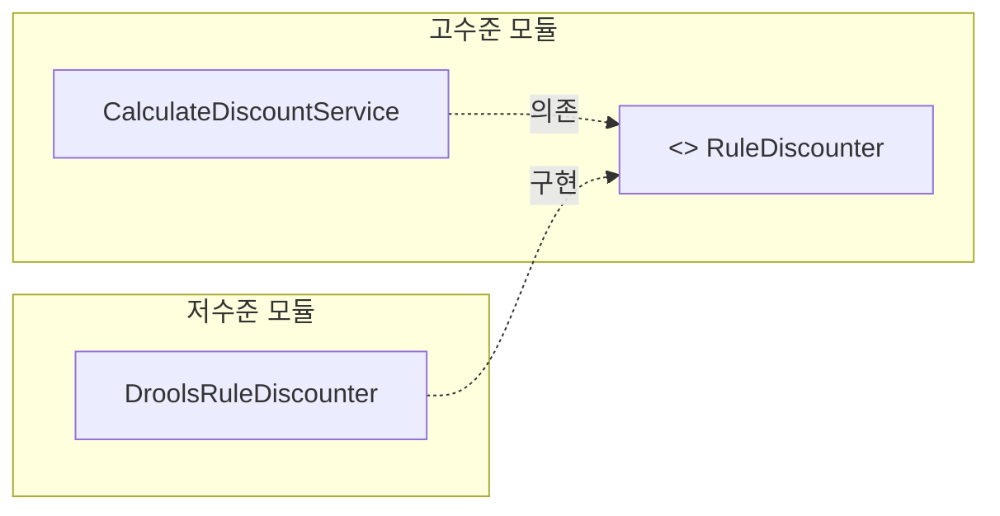
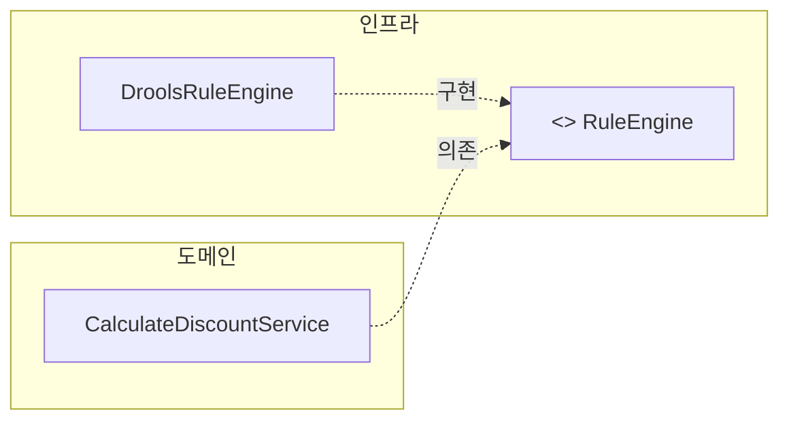
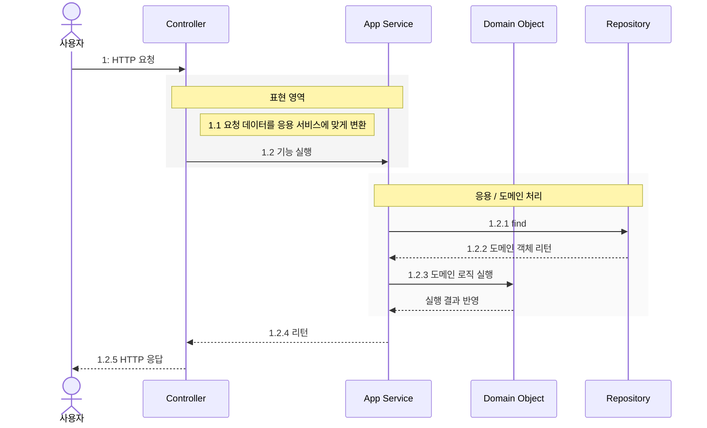

# DDD 같이 읽기 - 아키텍처 개요

### 아키텍처

**표현영역**

UI 영역에서는 사용자 응용계층에서 요청과 응답을 받는 역할을 수행.

사용자는 웹브라우저를 사용하는 사용자 ↔ REST API 호출하는 사용자.

**응용계층**

로직을 직접 수행하기 보다는 도메인 모델에 로직 수행을 위임.

ex.

orderService.cancelOrder(orderId)

→ 도메인 로직에 위임하는 예.

```jsx
public void cancelOrder (Long orderId) {
	order = service.findByIdThrowExceptIfNull(orderId);
	order.cancel();
}
```

**도메인 영역**

응용 계층이 사용하는 핵심 비즈니스 로직 

```java
order = service.findByIdThrowExceptIfNull(orderId);
...
**order.cancel();**
```

**인프라 스트럭처**

DB, SMTP 등등이 필요한 경우 응용계층에서는 모듈을 사용하여 데이터를 읽거나 연동 모듈을 이용해 외부와 통신할 수 있음.

→ 이 영역은 개념을 표현하거나 추상화되기 보다는 구현을 중심에 둠.

---

### 계층적 아키텍처

controller(표현) → service(응용) → domain → repository or infrastructure

엄격한 계층 구조를 이용하면 상위 계층으로는 의존하지 않음.

하지만 때에 따라 유연하게 계층구조의 의존을 운영하기도함.

하지만 문제

고수준 모듈이 저수준 모듈에 의존하여 사용하는 경우.

→ service 가 infrastructure 를 의존할 경우 문제.

1. 외부 시스템의 룰에 의존하여야함.
    
    예를 들어 외부 모듈을 끌어다가 쓰면 아래와 같은 **외부 룰**에 의한 코드를 반영해야함.
    
    ```jsx
    public void doSomething(String sessionName, Array<String> arr) {
    	session.open(sessionName);
    	forEach -> arr (x) : session.insert(x);
    }
    ```
    
2. 외부 시스템에 의존하기 때문에 동작성을 실제 구현까지 테스트해야함.
3. 쓸데없는 코드 발생 
    
    `return m.toImutableMoney();`
    
    ```jsx
    MutableMoney m = new MutableMoney(...);
    arr.add(m)
    doSomething(sessionName, arr)
    **return m.toImutableMoney();**
    ```
    

그러면 답은?

### DIP

DIP 는 모두가 알다시피 의존 역전의 설계 방법이다.

**~~고수준 모듈이 저수준 모듈에 의존하여 사용하는 경우와~~** 대비하여 저수준 모듈의 구체화된 것을 인터페이스화 시키면 인터페이스는 고수준 모듈에 편입이되며, 다른 고수준 모델은 해당 고수준 추상화된 인터페이스를 의존한다.



즉, 의존관계는 (**고수준 → 인터페이스 ← 저수준)**

1. 테스트를 진행하며 모킹처리를 하여 다양하게 테스트가 가능하다.
2. 사용할 저수준의 객체를 직접 생성하여 고수준 모듈의 코드 수정 없이 사용할 저수준의 객체만 다시 만들어주면 된다. 즉, 의존 역전이 되면서 변경 없이 구현이 가능하다.
    
    ```java
    // 사용할 구현체를 생성하는 코드만 변경되면 됨.
    RuleDiscounter interfaceRule = new Concrete1RuleDiscounter();
    RuleDiscounter interfaceRule = new Concrete2RuleDiscounter();
    
    // 코드 변경 없음.
    CalculateDiscountService service = new CalculateDiscountService(interfaceRule);
    ```
    

### DIP 주의사항

1. 고수준 모듈의 관점에서 설계해야한다.
    
    **RuleEngine** 처럼 인프라를 도메인 기준으로 추출하는 경우가 있다. 이처럼 저수준 모듈에서 인터페이스를 추출하게되면, service 입장에서 봤을 때 할인 금액을 구하기 위해 룰 엔진을 사용하는지 직접 연산하는지 중요하지 않다.
    
    단지 규칙에 따라 calculate 하는게 관건일 뿐이다. 즉, 도메인 주도 설계를 위해서는 저수준의 모듈을 고수준의 모듈로 (고수준 모듈의 관점) 으로 설계하는 것이 맞다.
    



1. **DIP 를 항상 적용할 필요는 없다.**
    
    사용하는 구현 기술에 따라 완벽한 DIP 를 적용하기 보다는 구현 기술에 의존적인 코드를 도메인에 일부 포함하는게 효과적일 때도 있다.
    
    또는, 추상화 대상이 잘 떠오르지 않을 때도 있다. 이럴때는 무조건 적용하기보다는 DIP 의 이점을 얻느 수준에서 적용 범위를 검토한다.
    

### 애그리거트의 장점

1. 도메인 모델의 목적은 도메인에 대한 객체를 지속적으로 사용하기 위함.
    
    도메인 모델(객체)를 지속적으로 유지하기 위해 외부 모듈에 저장해야함. 즉, 도메인 모델을 저장하기 위한 고수준 모듈로써 역할을 함.
    

ex. → 

```jsx
repository class {
	public Long save(도메인 모델(애그리거트)) {
		entity = EntityMapper.toEntity(도메인 모델);
		persistence.save(entity); (DB SAVE)
	}
}
```

1. 만약 애그리거트 최상위에서 뭔가를 변경하는 메소드를 실행하면 최상위의 변경 정책을 따라갈 수 밖에없다. 즉, 캡슐화를 잘 시켜서 상위 애그리거트가 제공하는 기능을 실행하고 애그리거트 루트를 통해서 간접적으로 애그리거트 내의 다른 엔티티나 밸류 객체에 접근한다.

ex. →

```java
public class Order {
	// value
	private ShippingInfo shippingInfo;
	...
	public void changeShippingInfo(ShippingInfo info) {
		checkShippingInfoChangable();
		this.shippingInfo = infop;
	}
	
	private checkShippingInfoChangable() {
		... 하위에 shippingInfo 클래스가 있더라도 해당 규약을 따른다.(캡슐화)
	}
}

------------------------------------------------------------

@Getter
public class ShippingInfo {
	private ...
}

```

### 요청 흐름 처리

응용 서비스는 도메인 모델을 이용해서 기능을 구현한다. 

두개의 도메인 모델을 사용하여 구현하기도 한다.

도메인 모델을 이용해서 구현할 때는 @Transactional 어노테이션을 활용하여 트랜잭션 관리를 잘할 수 있게한다.

```java
@Transactional
public void cancel(OrderNumber number) {
	Order order =	repository.find(number);
	order.cancel();
	.
	.
}
```



### 모듈 구성

그러면 도메인 모듈은 도메인이 속한 애그리거트를 기준으로 다시 패키지를 구성한다. 예를 들어 카탈로그 하위 도메인이 상품 애그리거트와 카테고리 애그리커트로 구성될 경우 카탈로그 -> 도메인 -> 상품,카테고리로 구성할 수 있다.

이 구조는 이런 메시지를 준다.

“카탈로그 도메인 안에는 상품과 카테고리라는 서로 다른 애그리거트가 있다.”

즉 `catalog` 하나가 통째로 하나의 애그리거트라는 뜻이 아니라,

- `catalog` = 상위 도메인/모듈
- 그 안의 `product`, `category` = 각각의 애그리거트

이렇게 나누면 보통 **다른 애그리거트 객체를 직접 물고 있지 않게** 설계하기 쉬워진다.

예를 들어 상품이 카테고리에 속해도 보통 이렇게 간다.

```
class Product {
	private CategoryId categoryId;
}
-------------------------------------------------------------------------------------
com.myapp.catalog
├── application
│   ├── CreateProductService.java
│   └── ChangeCategoryService.java
├── domain
│   ├── product
│   │   ├── Product.java
│   │   ├── ProductId.java
│   │   ├── ProductRepository.java
│   │   └── ProductStatus.java
│   └── category
│       ├── Category.java
│       ├── CategoryId.java
│       ├── CategoryRepository.java
│       └── CategoryName.java
└── infrastructure
    ├── product
    │   └── JpaProductRepository.java
    └── category
        └── JpaCategoryRepository.java
```

이렇게 **`Category` 객체 자체를 들고 있는 게 아니라 `CategoryId`만 참조**하는 식이다.

왜냐면 `Product` 와 `Category` 는 **서로 다른 애그리거트**일 가능성이 크기 때문이다.

이런 경계가 패키지로도 드러난다.