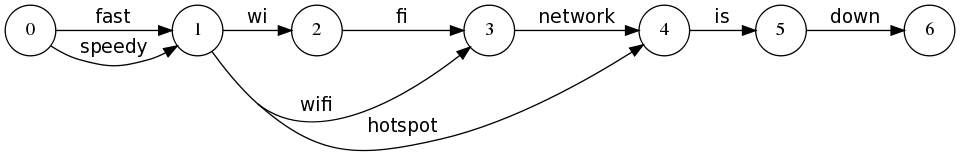

# 검색엔진 개선 (동의어)

[Boosting the power of Elasticsearch with synonyms](https://www.elastic.co/blog/boosting-the-power-of-elasticsearch-with-synonyms)

### 현재

현재 팔라고 상품 인덱스에서는 **인덱싱 시점의 동의어**가 적용이 되어있음.

인덱싱 시점의 검색어 동의어는 재색인 없이는 변경할 수 없습니다. 하지만 확장 프로세스 비용을 사전에 지불하므로 쿼리 시점에 매번 다시 수행할 필요가 없어 일치시켜야 할 용어의 수가 더 많아질 가능성을 줄일 수 있기 때문입니다.

반면에, 검색시 동의어는 인덱싱 시 동의어를 사용할 때 얻을 수 있는 이익은 성능대비 이점이 있는지 찾아보았습니다.

- 인덱스 크기가 변경되지 않는다.
- 동의어 규칙이 변경되더라도 문서 색인을 다시 생성할 필요가 존재하지 않는다.
    - 이전에는 검색 시 동의어를 사용할 때 또 다른 주의 사항이 있었습니다. 동의어 규칙을 변경해도 문서 인덱싱을 다시 할 필요는 없지만, 규칙을 변경하려면 인덱스를 일시적으로 닫았다가 다시 열어야 했습니다. 분석기가 인덱스 생성 시, 노드가 재시작될 때, 또는 닫힌 인덱스가 다시 열릴 때 인스턴스화되기 때문입니다.

그렇다면 현재 인덱스에는 약 **12,000개** 가까운 데이터가 존재하는데, 성능상의 이점은 12,000개가 일으킬 순 없을 것 같습니다.

<aside>
💡

The last two, especially, are a great disadvantage. The only potential advantage of index-time synonyms is performance, since you pay the cost for the expansion process upfront and don’t have to perform it each time again at query time, potentially resulting in more terms that need to get matched. This, however, usually isn’t a real issue in practice.

</aside>

엘라스틱 서치 문서에서는 성능상의 이점보다 얻을 수 있는 것이 더 크다고 설명합니다.

운영상의 이유로 동의어 API 는 변경이 꼭 필요한 대목입니다.

### 검색시 동의어 VS 인덱싱 시 동의어

[Lucene's TokenStreams are actually graphs!](https://blog.mikemccandless.com/2012/04/lucenes-tokenstreams-are-actually.html)

synonym 의 종류에는 두가지 방식이 존재합니다.

1. **synonym + API**
    
    기존 동의어는 아래와 같은 동작을 합니다.
    
    텍스트 → 토큰 나열 (linear stream) 즉, 예를 들어서 설명하자면,
    
    **wi fi network →** [`wi`] [`fi`] [`wifi`] [`network`] 라는 단어로 토크나이저 화가 됩니다. 근데 이렇게 분리되었을 때 를 “소세지화” 라고 문서에서는 정의하고 있어요.
    
    이 소세지화가 됐을 때 이 토큰들이 **서로 어떤 묶음인지 정보가 사라진다는** 단점이 존재합니다.
    
    즉, `wi+fi`가 `wifi`라는 사실을 인덱스가 모름
    
2. **synonym graph + API**
    
    하지만 그래프는 아래와 같이 graph 기반 필터는 토큰을 **경로(Path)** 로 유지한다.
    
    
    
    ```jsx
    (position 0)
       ├─ wi ─ fi ─────────┐
       │                   ├─ network
       └────── wifi ───────┘
    (position 3)
    ```
    
    `wi → fi` 와 `wifi`는 **동등한 경로로** “두 단어 vs 한 단어”라는 **구조 정보가 유지된다고 봅니다.**
    

**그래서? 그러면 뭘써야하는데?**

문제점을 설명하자면 아래와 같아요.

- wifi network 라는 문자열로 매칭이 시도될때. (일반 토크나이저)
    - **`wi fi` network** 가 존재하여도 매칭이 실패하거나 엉뚱하게 매치가 발생해요. ****
- 반면, (그래프)
    - wi fi network, wifi network 노드를 거쳐오기 때문에 동등한 경로로 구조정보가 유지되니 해당 매칭이 확실하게 매칭이 돼요.
    - **하지만 인덱싱 시점에는 사용이 불가능해요**
        
        인덱스(inverted index)는 **그래프를 저장 못 한다는 성격**을 지니고 있어요.
        

### 그래프의 한계는 ?

[인덱스(inverted index)는 **그래프를 저장 못 한다는 성격**을 지니고 있어요.](https://www.notion.so/inverted-index-3021d093ae9880ffa854d37a8db2c200?pvs=21) 를 더자세히 파보면 아래와 같아요.

그래프를 표현하기 위해서는 두 정보가 필수에요.

1. **PositionIncrementAttribute (posInc)**
    - 이 토큰이 이전 토큰에서 **몇 칸 뒤 위치**에 있냐 → 어느 지점에서 부터 시작하냐는 관점.
2. **PositionLengthAttribute (posLen)**
    - 이 토큰이 **몇 칸을 차지하냐 → 얼마나 길게 뻗냐는 관점.**
    - 예: `hotspot`이 사실 `wi fi network`(3칸)을 대표하면 posLen=3

인덱스는 위의 정보 중 posLen 의 정보를 따로 저장하거나 활용하지 않아요. 그러면 그래프의 길이/연결 정보가 날라가서 내가 찾고자하는 경로가 아니라 그냥 같은 위치에 단어들이 모여있는 것 처럼 보고 그래프의 본질을 무시한채 매칭이 엉뚱하게 되는 현상이 발생해요.

그래서 그래프는 쿼리를 만들 때(search-time)에 그래프를 들고 쿼리를 만들어서 **GraphQuery(경로 기반 쿼리)** 로 바꿔줍니다.
저

### 적용

[Synonym Graph Token Filter | Elasticsearch Guide [7.3] | Elastic](https://www.elastic.co/guide/en/elasticsearch/reference/7.3/analysis-synonym-graph-tokenfilter.html)

### 1. synonym 생성

```json
PUT /_synonyms/palrago-product-db-keyword-synonym-set
{
    "synonyms_set": [
        { "synonyms" : "BHC, 비에이치씨, 비에치씨치킨"},
        { "synonyms" : "교촌치킨, 교촌"},
        { "synonyms" : "굽네치킨, 굽네, 굽네오븐치킨"},
        { "synonyms" : "네네치킨, 네네"},
        { "synonyms" : "또래오래, 또래오래치킨"},
        { "synonyms" : "맘스터치, 맘스, 맘터"},
        { "synonyms" : "맥도날드, 맥날"},
        { "synonyms" : "KFC, 케이에프씨"},
        { "synonyms" : "써브웨이, 서브웨이, subway"},
        { "synonyms" : "쉐이크 쉑, 쉑쉑"},
        { "synonyms" : "파파존스, 파파존스피자"},
        { "synonyms" : "도미노피자, 도미노"},
        { "synonyms" : "미스터피자, 미피"},
        { "synonyms" : "피자헛, PizzaHut"},
        { "synonyms" : "피자알볼로, 알볼로, 알볼로피자"},
        { "synonyms" : "빕스, VIPS, 빕스스테이크"},
        { "synonyms" : "아웃백, 아웃백스테이크, 아웃백스테이크하우스"},
        { "synonyms" : "본죽, 본죽&비빔밥"},
        { "synonyms" : "배스킨라빈스, 배라"},
        { "synonyms" : "던킨, 던킨도너츠"},
        { "synonyms" : "스타벅스, 스벅, Starbucks"},
        { "synonyms" : "투썸플레이스, 투썸, A TWOSOME PLACE, TWOSOMEPLACE, TWOSOME"},
        { "synonyms" : "할리스, 할리스커피, Hollys"},
        { "synonyms" : "컴포즈커피, 컴포즈, Compose"},
        { "synonyms" : "메가MGC커피, 메가커피, 메가, MGC"},
        { "synonyms" : "빽다방, 빽카페"},
        { "synonyms" : "이디야커피, 이디야, EDIYA"},
        { "synonyms" : "폴 바셋, 폴바, PaulBassett"},
        { "synonyms" : "블루보틀, BlueBottle"},
        { "synonyms" : "탐앤탐스, 탐탐, TomNToms"},
        { "synonyms" : "엔제리너스, 엔젤, Angelinus"},
        { "synonyms" : "감탄떡볶이, 감떡, 감탄"},
        { "synonyms" : "신참떡볶이, 신참, 신참떡"},
        { "synonyms" : "응급실국물떡볶이, 응떡, 응급떡볶이"},
        { "synonyms" : "노브랜드버거, 노브랜드, NBB"},
        { "synonyms" : "빽보이피자, 빽보이, 백보이피자"},
        { "synonyms" : "고피자, GO피자, GoPizza"},
        { "synonyms" : "성심당, 성심빵집"},
        { "synonyms" : "앤티앤스프레즐, 앤티앤스, AuntieAnne’s"},
        { "synonyms" : "백미당, Baekmidang"},
        { "synonyms" : "순살만공격, 순살공격"},
        { "synonyms" : "호식이두마리치킨, 호식이"},
        { "synonyms" : "지코바치킨, 지코바"},
        { "synonyms" : "푸라닭, 푸닭, Puraldak"},
        { "synonyms" : "충만치킨, 충만"},
        { "synonyms" : "치킨플러스, 치플"},
        { "synonyms" : "호치킨, HoChicken"},
        { "synonyms" : "맥시칸치킨, 맥시칸"},
        { "synonyms" : "멕시카나치킨, 멕시카나"},
        { "synonyms" : "깐부치킨, 깐부"},
        { "synonyms" : "빅스타피자, 빅스타, BigStar"},
        { "synonyms" : "세븐일레븐, 세븐"},
        { "synonyms" : "CU, 씨유, CU편의점"},
        { "synonyms" : "GS25, GS, GS편의점"},
        { "synonyms" : "이마트24, Emart24"},
        { "synonyms" : "아이스 아메리카노, 아아"},
        { "synonyms" : "뜨거운 아메리카노, 뜨아, 따아"}
    ]
}
```

1. 추후 추가할 API
    
    ```json
    PUT _synonyms/palrago-product-db-keyword-synonym-set/<id>
    {
      "synonyms": "wi fi, hotspot"
    }
    ```
    
2. 분석 검증
    
    ```json
    GET palrago-product-db-keyword-v2/_analyze
    {
      "analyzer": "nori_search_analyzer",
      "text": "wi fi"
    }
    ```
    
3. synonym 생성 확인
    
    ```json
    GET _synonyms/palrago-product-db-keyword-synonym-set?from=0&size=1000
    ```
    

---

### 2. 인덱스 V2 생성

```json
PUT palrago-product-db-keyword-v2 
{
  "settings": {
    "analysis": {
      "char_filter": {
        "remove_specials": { // 특수문자 제거
          "type": "pattern_replace",
          "pattern": "[^\\p{L}\\p{N}\\s]",
          "replacement": ""
        }
      },
      "filter": {
        "palrago-synonym-graph": {
          "type": "synonym_graph",
          "synonyms_set": "palrago-product-db-keyword-synonym-set",
          "updateable" : true
        }
      },
      "analyzer": {
        "nori_analyzer": {
          "type": "custom",
          "char_filter": ["remove_specials"],
          "tokenizer": "nori_tokenizer",
          "filter": [
            "lowercase"
          ]
        },
        "nori_search_analyzer": {
          "type": "custom",
          "char_filter": ["remove_specials"],
          "tokenizer": "nori_tokenizer", 
          "filter": [
            "lowercase",
            "palrago-synonym-graph" 
          ]
        }
      }
    }
  },
  "mappings": {
    "properties": {
      "product_id": {
        "type": "keyword"
      },
      "brand_keyword": {
        "type": "keyword"
      },
      "product_keyword": {
        "type": "keyword"
      },
      "brand_title": {
        "type": "text",
        "analyzer": "nori_analyzer",
        "search_analyzer": "nori_search_analyzer"
      },
      "product_title": {
        "type": "text",
        "analyzer": "nori_analyzer",
        "search_analyzer": "nori_search_analyzer"
      },
      "reg_date": {
        "type": "date"
      },
      "upd_date": {
        "type": "date"
      },
      "chg_date": {
        "type": "date"
      }
    }
  }
}
```

---

### 3. 데이터 이동

```json
POST _reindex
{
  "source": {
    "index": "palrago-product-db-keyword"
  },
  "dest": {
    "index": "palrago-product-db-keyword-v2"
  }
}
```

1. 데이터 이동 검증
    
    ```json
    GET /palrago-product-db-keyword/_search
    {
    	"query": {"match_all" : {}}
    }
    ```
    

---

### 4. 서버 동일 쿼리 검증

```json
GET /palrago-product-db-keyword-v2/_search
{
  "query": {
    "bool": {
      "must": [
        {
          "match": {
            "product_title": "아이스크림"
          }
        },
        {
          "match": {
            "brand_title": "TWOSOME"
          }
        }
      ]
    }
  }
}

GET /palrago-product-db-keyword-v2/_search
{
  "query": {
    "bool": {
      "must": [
        {
          "term": {
            "product_keyword": "요거트 아이스크림 + 초코 쿠키 요거트 아이스크림"
          }
        },
        {
          "term": {
            "brand_keyword": "투썸플레이스"
          }
        }
      ]
    }
  }
}
```

### 5. 검증 완료 후 실제 적용

위의 3번 과정을 제외하고 다시 index 합니다.