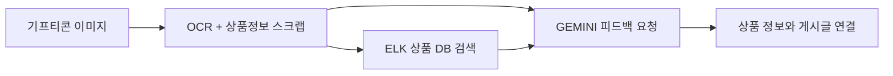

# 검색엔진 개선

## 1. 현재 기프티콘 상품 검색 구조

지금 사용 중인 기프티콘 상품 검색 구조는 대략 다음과 같은 흐름으로 동작하고 있다.

먼저 기프티콘 이미지를 입력받는다.

입력된 이미지는 NAVER, GEMINI 등의 OCR을 통해 텍스트를 추출하고, 필요한 경우 상품 정보를 스크래핑해서 보완한다. 이 과정에서 브랜드명, 상품명과 같은 기본적인 상품 정보가 만들어진다.

이후 OCR과 스크래핑으로 얻은 데이터를 기준으로 내부 상품 DB, 즉 Elasticsearch(ELK)에 검색 쿼리를 날린다.

ELK에서 얻은 검색 결과(인덱스 데이터)와 OCR 결과를 다시 GEMINI에 전달해, “이 결과가 어떤 상품인지”에 대한 피드백을 요청한다.

GEMINI의 피드백 결과와 내부 상품 DB의 정보가 일치하는 경우, 해당 상품 정보와 게시글 데이터를 서로 연결하는 방식이다.

이 흐름을 단순화하면 다음과 같다.



---

## 2. 발생하는 문제 상황

문제는 이 흐름 중, GEMINI가 내려주는 브랜드명이 내부 상품 DB에 저장된 값과 다를 때 발생한다.

예를 들어 GEMINI가 `A TWOSOME PLACE`라는 값을 서버로 전달하는 경우가 있다.

하지만 내부 상품 DB(ELK)에는 해당 브랜드가 `투썸플레이스`로 저장되어 있다.

이 경우 동일한 브랜드임에도 불구하고, ELK 검색 단계에서 결과를 찾지 못해 상품 매칭이 실패한다.

이 현상은 특정 브랜드 하나에 국한된 문제가 아니라, 현재 검색 구조 전반에서 반복적으로 발생하고 있다.

---

## 3. 현재 검색 구조의 한계

현재 브랜드 검색에는 다음과 같은 구조적인 특징이 있다.

- 브랜드 서칭에 nori 토크나이저 하나만 사용하고 있음
- 검색 대상이 되는 필드에 영문과 한글이 함께 섞여 있음
- 브랜드 정보는 `brand_title`이라는 단일 필드에 저장됨
- 대부분의 브랜드는 한글 기준으로 저장되어 있음

이 구조 때문에 특정 형태의 검색 요청을 제대로 처리하지 못한다.

---

## 4. 대표적인 검색 실패 사례

### 4.1 Nintendo Switch

Nintendo Switch의 경우, 내부 DB에는 브랜드가 `닌텐도`로 저장되어 있다.

하지만 검색 요청이 다음과 같은 형태로 들어오면 모두 히트하지 않는다.

- `닌텐도`

또는

```json
{
	"match":{
		"brand_keyword":"닌텐도"
	}
}
```

---

### 4.2 CJ 상품권

CJ 상품권 역시 마찬가지다.

내부 DB에는 `CJ상품권`으로 저장되어 있다.

하지만 검색 요청이 아래와 같은 형태로 들어오면 모두 히트하지 않는다.

- `씨제이`

```json
{
	"match":{
		"brand_keyword":"씨제이"
		}
}
```
---

### 4.3 A Twosome Place

A Twosome Place의 경우 내부 DB에는 `투썸플레이스`로 저장되어 있다.

하지만 OCR이나 GEMINI 결과가 `A Twosome Place`로 들어오는 순간, 한글/영문 표기 차이로 인해 검색이 실패한다.

---

## 5. 해결 방안에 대한 검토 과정

이 문제를 해결하기 위해 몇 가지 방향을 검토했다.

### 5.1 GEMINI 프롬프팅을 한글로 제한하는 방식

먼저 GEMINI 프롬프팅 단계에서 무조건 한글 브랜드명으로 응답하도록 유도하는 방법을 생각해봤다.

이 경우 많은 케이스에서는 매칭이 수월해지지만, Nintendo나 CJ 상품권처럼 영문이나 약어 자체가 문제인 경우에는 근본적인 해결이 되지 않는다.

---

### 5.2 영문 필드와 한글 필드를 분리하는 방식

또 다른 방법으로는 브랜드를 영문 필드와 한글 필드로 나누어 저장하고, 각각 다른 analyzer를 적용한 뒤 조합 쿼리를 하는 방식이 있다. 실제로 많은 검색 시스템들이 이 방식으로 문제를 해결하고 있는 것으로 보인다.

다만 이 방식에는 현실적인 제약이 있다.

RDB에도 동일한 구조를 가져가야 하는데, 예를 들어 `원할머니보쌈` 같은 브랜드의 경우 검색을 위해 `One GrandMother Bossam` 같은 영문 값을 정의해야 한다. 이는 내부적으로 의미 없는 작업에 가깝다.

이렇게 되면 검색용 영문 필드가 null로 남아 있는 브랜드가 대량으로 생길 가능성이 높아진다. 또한 현재 내부 시스템은 검색엔진을 사용자 검색용으로 직접 제공하는 구조가 아니라, 간접적으로 상품을 수동 등록하거나 AI 결과를 검증하기 위해 쿼리를 한 번 더 사용하는 정도의 용도다.

이런 상황에서 스키마 변경과 null 필드 증가에 대해 팀원들이 보수적인 입장을 보였고, 해당 방안은 적용하지 않기로 했다.

** 해당 방식은 나중에 정말로 검색에 대해서 직.간접적으로 검색을 사용자가해야하는 경우에 개발할 방식이다. **

---

## 6. Synonym 수정에 대한 고민

결국 현재 구조에서 현실적으로 검토하게 된 방향은 synonym 수정이다.

한글, 영문, 약어 차이로 인해 발생하는 검색 실패를 synonym으로 흡수하는 방식이다.

다만 Elasticsearch 특성상 synonym을 수정하면 재인덱싱이 필요하다.

그래서 synonym이 자동으로 추가될 경우, 재인덱싱까지 함께 수행되는 자동 파이프라인을 만들어보는 방향을 검토하고 있다.

[검색엔진 개선 (동의어)](./검색엔진 개선 (동의어).md)