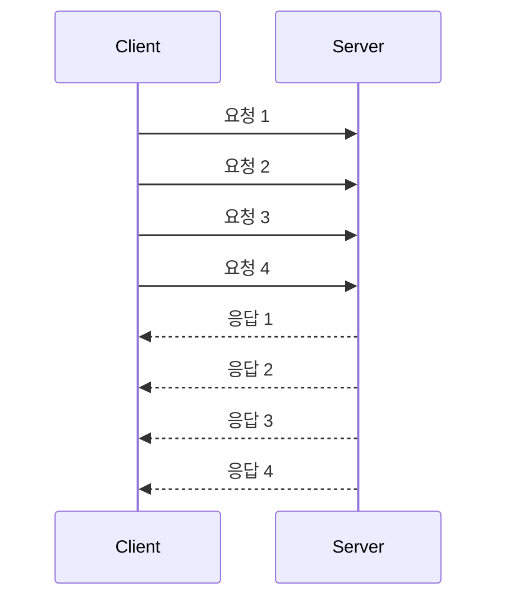

### 출력 버퍼
- 클라이트에 반환할 데이터를 임시로 저장하기 위한 공간.
- 클라이언트 수에 비례
- 특히 pub/sub 에서는 생산자가 발행하는 속도보다 처리하는 속도의 차이가 발생할 수 있음.
```
CONFIG SET client-output-buffer-limit <class> <hard-limit> <soft-limit>
```
```
CONFIG GET client-output-buffer-limit client-output-buffer-limit
normal 0 0 0 slave 268435456 67108864 60 pubsub 33554432 8388608 60
```
- class 
    - normal (일반 클라이언트)
    - slave(replicaof)
    - pub/sub
- 하드제한은 고정된 제한값 (00 메모리에 닿으면 연결 끊음)
- 소프트 제한은 (00 초 동안 00 메모리에 닿으면 연결 끊음)

### 클라이언트 버퍼
- 레디스는 기본적으로 사용자 명령을 버퍼에 저장해놓고 순차적으로 실행함.
- 기본 1gb
- client-query-buffer 설정으로 변경 가능.

<HR>

### 클라이언트 이빅션
- maxmemory-clients 설정 값으로 모든 클라이언트가 사용하는 누적 메모리(쿼리버퍼, 출력버퍼, 중간버퍼 등)의 설정
- 임계치보다 증가하면 제일 많이 사용하는 클라이언트 부터 연결 해제
- redis.conf 및 CONFIG SET 으로 설정 가능
```
> CONFIG GET maxmemory-clients
maxmemory-clients
0
```
- 0은 사용하지 않는다는 뜻.
- maxmemory-clients 1G 또는 maxmemory-clients 5% 와 같이 %로도 가능.
- 대규모 트래픽에서는 해당 설정을 고려
- **복제-마스터 커넥션은 연결에 지장을 받지 않음**
- **```CLIENT NO-EVICT on``` 으로 이빅션 영향 설정을 안받게도 가능**

<HR>

### 파이프라이닝
만약 네트워크 통신이 250ms 인 요청이 있다. 하지만 초당 10만개의 처리를할 수 있는 레디스여도 해당 요청에 대해선 초당 4개의 요청밖에 처리를 못 함.

- 파이프라이닝

장점
- 상기 문제를 해결함.
- 커널 수준에서도 소켓 io 를 수행할 때 운영체제 커널 영역의 read(), write() 를 한번에 처리할 수 있어서 시스템 콜을 줄임.

단점
- 커맨드가 많아질수록 초당 수행되는 총 쿼리수가 선형 증가.
- 네트워크 대역폭의 한계로 인해 속도 저하 가능성
- 클라이언트 쿼리 버퍼 제한으로 인한 성능 이슈
- 적당한 배치 사이즈로 나눠서 보내는 것을 권장
- 원자성을 지키지 않음
    - 다른 클라이언트의 접근을 차단하지 않고 파이프라인 내부의 각 커맨드만이 원자적으로 수행


### 클라이언트 사이드 캐싱
레디스의 캐싱기능으로도 성에 안찬다면 고려.
- 기본모드
    - 레디스 서버가 클라이언트가 액세스한 키를 기억해서 동일한 키가 수정될 때 무효메세지 전송
- 브로드캐스팅 모드
    - 레디스 서버가 모든 키에 대한 액세스를 기억하려고 시도하지 않음. 특정 프리픽스에 대해 접근한 클라이언트만 기억.
    - 기본 모드보다 메모리 사용량이 적음. 대신 클라이언트는 특정 프리픽스를 가진 키를 기억해야함.
