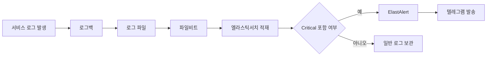
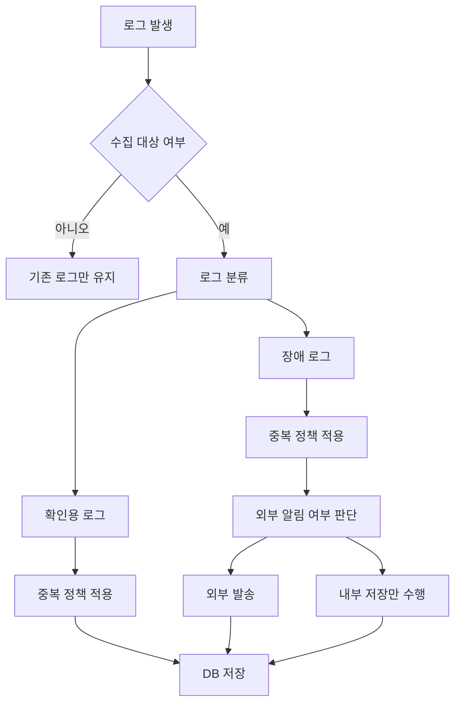
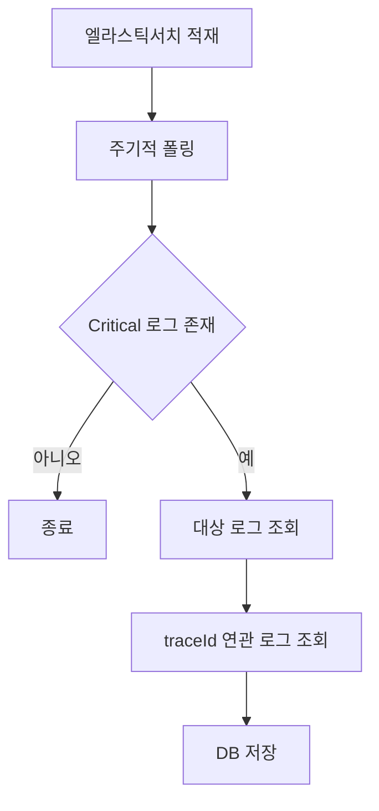
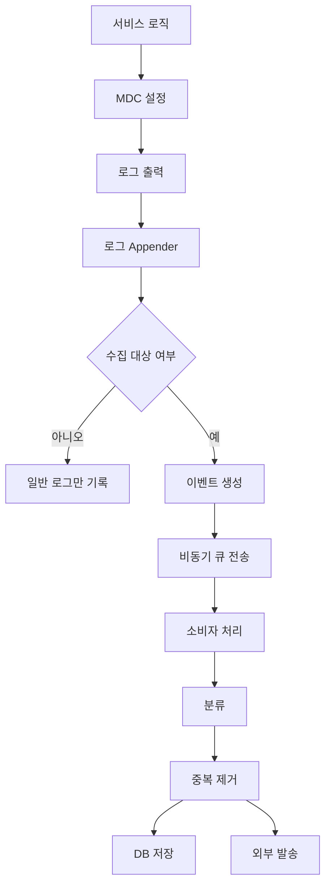
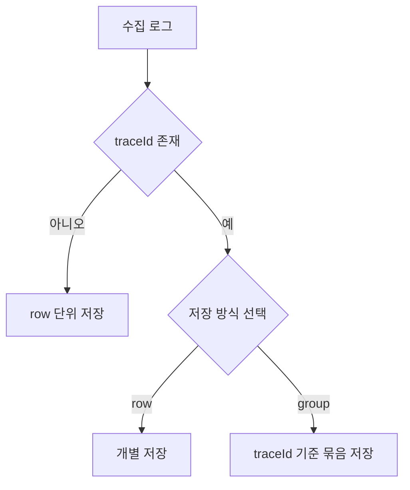
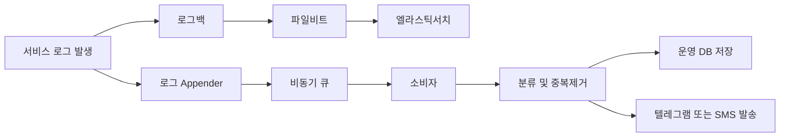

# 운영 로그 DB 적재 개선안

### 현행 구조

- 현재는 로그를 파일로 남긴 뒤 Elasticsearch 에 적재 중
- `[Critical]` 문자열 포함 시 ElastAlert 가 텔레그램 발송
- 즉, 현재 구조는 **문자열 감지 기반 알림**에는 적합함
- 하지만 이번 요구사항은 **저장 대상 선별 / 분류 / 중복제거 / 외부알림 분리**까지 필요함
- 따라서 단순 `[Critical]` 검색만으로는 한계 있음

### DB 저장 조건

1. 로깅 실행
2. 로깅 분류
    - 해당 로깅이 아침에 관리자가 항상 확인해야하는 메세지인지 판별 (경고성 에러도 포함 분리 의도있음.)
    - 장애 로깅이기 때문에 사용자에게 외부 메신저로 알려야하는지 판별
    - 장애 로깅이지만 외부 메신저로 전달이 안되는 것도 존재
3. 로깅 중복 제거
    - 확인성 메일이나 메세지는 매번 대상이 다름 그래서 해당 이벤트가 발생할 때 로깅은 계속적으로 쌓아줘야함.
        - ex. 만약 1시간마다 배치에서 가탈퇴 회원 대상으로 탈퇴를 실행하는데 데이터 불일치로 1시간마다 계속 탈퇴시도를 하는 유저가 존재. 또는 각각 1시간마다 계속 탈퇴시도를 진행하였으나 탈퇴는 정상적으로 되었고, 다만 데이터에 이상이 있어 매번 확인해야할 때.
    - 장애 로깅에서도 매번 로깅을 계속적으로 쌓아줘야하는 경우도 생기지만, 때에 따라서 매번 쌓지 않아야하는 경우도 존재함.
        - ex. 매번 쌓아야하는 케이스
            - 유저 토큰이 내 유저 아이디와 토큰의 유저 아이디가 일치하지 않는 경우
        - ex. 매번 쌓지 않는 케이스
            - 출금을 하다가 타임아웃이 연쇄적으로 발생하는 경우
                - 모든 유저가 동일 증상을 겪고 있는 것이기 때문에 이 로그 자체는 한번만 남겨도 무방
4. 로깅 저장 전략 (선택)
    - 로깅이 한 트랜잭션에서 여러군데 찍혔을 때 trace id 가 다 동일한데 이 trace id 를 group by 하여 하나의 로깅으로 보고 저장해야하는 것도 저장 전략의 하나임.
        - RDB 의 경우 쿼리로도 [TRACE.ID](http://TRACE.ID) 추격이 가능하니 ROW 단위로 관리하여도 무방

### 추상화

공통.

1. 팀 컨벤션으로 로깅 컨벤션 (**로그 도메인으로 정의 코딩**)
    - 필요 항목 (DB 스킴 겸 로깅 컨벤션)
        - [CRITIAL] OR [COLLECT] - 일단 수집하겠다는 뜻.
            - 수집한 항목에 대해서는 일단 저장하겠다.
            - CRITICAL 은 무조건 알람으로 전송처리하고 있으므로 COLLECT 로 컨벤션 변경하여도 괜찮을 것 같음.
        - [LOG_LEVEL] - 확인해야할 항목 / 장애로 긴급하게 봐야하는 경우 레벨로 나눔. (구분자)
            - CONFIRM 레벨 - (확인해야할 항목) DEFAULT
            - ERROR - (장애 레벨)
                - [장애 레벨, 컨펌 레벨 에서도 공통에러인지, 공통에러가 아닌지를 구분할 요구사항](https://www.notion.so/3371d093ae9880efb430d5e218a6af40?pvs=21)
                    
                    하위 타입으로 아래와 같이 정의.
                    
                    - 매번 쌓지 않는 케이스 (SINGLE)
                    - 매번 쌓는 않는 케이스 (ACCUMULATE)
        - [EXTERNAL_ALERT_FLAG]
            - 외부로 전송하겠다는 뜻 (텔레그램 OR SMS) - [하지만 [CRITIAL] 로 대체가능](https://www.notion.so/3371d093ae9880efb430d5e218a6af40?pvs=21)
            - 외부 전송시 PUSHRECEIVER 사용 BIZTALK-MMS OR TELEGRAM

### 안1. 엘라스틱서치 폴링 방식

### 개요

- 5~30분 주기로 Elasticsearch 조회
- `[Critical]` 포함 로그 조회
- 발견 시 traceId 로 연관 로그 추가 조회
- 이후 DB 저장

### 장점

- 지금 구조 재활용 가능
- 제일 빨리 붙일 수 있음
- 초기 개발이 가장 쉬움

### 단점

- Elasticsearch 조회 권한 노출 우려 있음
- 다른 서비스 로그 접근 가능성 있음
- 폴링 주기 짧아지면 Elasticsearch 부하 우려 있음
- 결국 문자열 검색 중심이라 운영 정책 반영에 한계 있음

### 판단

- **단기 대응용으로는 가능**
- 하지만 **운영 이벤트 관리 구조로 보기엔 부족함**

### 안2. 서비스 내부 Appender + Queue 방식

### 개요

- 서비스에서 로그 발생 시 Appender 가 수집 대상 로그를 별도 이벤트로 만듦
- 비동기 큐로 전달
- 소비자가 분류 / 중복제거 / 외부발송 / DB저장 수행

### 장점

- 요구사항을 가장 정확하게 반영 가능
- 분류 / 중복정책 / 외부알림 분리 쉬움
- Elasticsearch 폴링 부담 줄일 수 있음
- 향후 대시보드나 운영 화면 연계하기 좋음

### 단점

- Appender, 큐, 소비자 설계 필요
- MDC 기준 정의 필요
- 메시지 크기, 실패 재처리 등 추가 검토 필요

## 저장 전략

이 부분은 선택사항임.

### 1안. row 단위 저장
- 구현 단순함
- DB 조회로 traceId 추적 가능

### 2안. traceId 그룹 저장
- 운영 화면에서 보기 좋음
- 하지만 집계 로직 추가 필요

## 최종 구조 요약도

