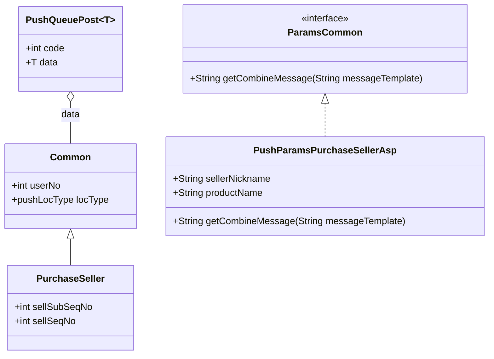

# 푸시 알림센터 개선기

저희 팔라고 서비스는 알림센터를 구축하여 사용하고 있습니다. 개선하게 된 이유는 서비스가 고도화되고 새로운 새로운 콘텐츠(티켓 장터)들이 추가되면서 보내야할 푸시 메세지들이 점점 많아지고 그에 따라 로직이 너무 길어졌습니다.

기존 저희 서비스에서 관리하고 있던 푸시 개선 히스토리를 간략하게 나열하겠습니다.

### V1

```jsx
pushService.send(userNo, "축하드려요! 판매하신 상품 아이스아메리카노T 가 구매확정되었어요");
```

정말 무식하게 그지없이 그냥 메세지를 만들어내고, 메세지를 보내는 로직으로 되어있었어요.

이 단점은 예외상황에서 트랜잭션이 보장되지 않았고, 비즈니스로직 처리가 되면서 꺼내왔던 모든 엔티티에서 판매자 닉네임, 상품 이름 등등을 자투리로 꽂아넣고 위의 예처럼 보내는 방식이였어요. 그래서 해당 필드가 어디서 사용되어지고 코드를 정리하고 리팩토링하는 과정이 너무 어려웠어요.

### V2

처음엔 트랜잭션 보장을 위해서 큐를 생각했어요. 푸시 트랜잭션이 어떤 에러를 뽑아내더라도, 비즈니스로직에는 영향을 미치지 말아야해요. 그렇게 생각한 이유는 푸시 자체가 보내는 기반(푸시 키 등등 푸시를 보내는데 필요한 요소)이 탄탄하더라도 간혹 어떤 이유에서인지 fcm 에서 보내지 못하는 이슈가 있었어요. 경험의 결과 너무 각기 다른 에러들이 많아 푸시 메세지는 중요한 트랜잭션이 아니다 라는 생각을 하게되었어요.

우선 큐 정의 및 소비자 메세지 파라미터입니다.

```jsx
	@RabbitListener(queues = RabbitMQConstants.PALRAGO_PUSH_SAVE_QUEUE)
	private void receiverForSavePushQueue(GenericQueue<PushQueuePost<? extends Common>> genericQueue) throws PalragoException
```

자세한 파라미터는 아래와 같아요.



`GenericQueue<PushQueuePost<? extends Common>` 해당 파라미터의 타입은 아래와 같아요.

```jsx
public class PushQueuePost<T extends PushMessageRequest.Common> {
	// 생략
	private int code; // 메세지의 타입
	private T data;
}

public static class Common {
	private int userNo;                            // 푸시 받는 유저 번호
	private CommonEnum.pushLocType locType;        // 푸시 보내는 위치

	private Common(int userNo, CommonEnum.pushLocType locType) {
		this.locType = locType;
		this.userNo = userNo;
	}
}
```

해당 Common 에는 푸시를 보낼 때 꼭 필요한 필수 파라미터를 받게 되어있고, 각각의 푸시 메세지의 파라미터를 치환을 위해 쿼리를 해야하는 필요한 시퀀스 정보를 받고있어요.

예를 들면 장터에서 판매자가 거래를 성사해서 아래와 같은 메세지를 보내야한다면?

**“축하드려요! #{닉네임}님이 판매한 #{상품명}이 구매확정되었어요!. #{마일리지} 만큼 적립이 되었으니 확인해주세요!”**

```jsx
public static class PurchaseSeller extends Common {
		private int sellSubSeqNo;
		private int sellSeqNo;
		
		//추가적인 메소드 생략
}
```

`sellSubSeqNo` 는 거래에 관한 상세 정보를 담고있는 테이블의 시퀀스이며, `sellSeqNo` 는 상품 정보가 저장되어있는 테이블의 시퀀스에요.

그러면 보내는 핵심 비지니스 로직은 아래와 같이 이뤄져요.

```jsx
if (queueData.getData() instanceof PushMessageRequest.PurchaseSeller
			&& PushCodeEnum.MARKET.PURCHASE.PURCHASE_SELLER.getCode() == queueData.getCode()) {

			// 셋팅에서 알림 허용 안했으면 전송 X
			if (isTxSysPushPermit(settings.getObjData())) {
				return;
			}

			// 캐스팅 요청 파라미터
			PushMessageRequest.PurchaseSeller body = (PushMessageRequest.PurchaseSeller)queueData.getData();

			
			Optional.ofNullable(selectPushMetaInfoMarket(queueData, body.getSellSubSeqNo()))
				.ifPresentOrElse(
					pushMetaInfo -> {
						try {
							sendWithCombinePushMessage(body.getUserNo(),
								PartnershipEnum.PALRAGO.getCode().equals(pushMetaInfo.getChannel())
									? "push.purchaseSeller" : "push.purchaseSellerAsp",
								body.getSellSeqNo(),
								pushMetaInfo);
						} catch (PalragoException e) {
							throw new RuntimeException(e);
						}
					},
					() -> {
						logger.debug("pushMetaInfo 정보 찾을 수 없음.");
					});

		} else if {
		} else if {
		} else if {
		} else if {
		.
		.
		.
```

1. 우선 `selectPushMetaInfoMarket` 로 내가 DB 에서 보낼 템플릿 메세지를 찾아요.
2. 그러면 `sendWithCombinePushMessage` 라는 메소드에서 해당 템플릿 메세지의 메타정보를 읽어와서 (ex. **“축하드려요! #{닉네임}님이 판매한 #{상품명}이 구매확정되었어요!. #{마일리지} 만큼 적립이 되었으니 확인해주세요!”)** 라는 템플릿을 들고옵니다. 
3. `? "push.purchaseSeller" : "push.purchaseSellerAsp",` 해당 부분에서 어떤 쿼리 id 로 쿼리를 날릴지 결정하고, `body.getSellSeqNo()` 라는 [**바디에 실어왔던 값**](https://www.notion.so/3061d093ae988007821ad6aa71c5961c?pvs=21)으로 쿼리해서 조회 후 파라미터를 조회합니다.
    
    ```jsx
    <select id="purchaseSellerAsp" parameterType="integer"
                resultType="kr.co.kpcard.palrago.common.push.domain.PushParams$PurchaseSellerAsp">
          <![CDATA[
            SELECT A.TITLE    AS productName,
                   B.NICKNAME AS sellerNickname
            FROM MARKET_SELL_MST A,
                 MB_MST B
            WHERE A.USER_NO = B.USER_NO
              AND A.SELL_SEQ_NO = #{sellSeqNo}
            ]]>
      </select>
    ```
    

4. 가져온 해당파라미터들로 아래와 같은 작업을 거쳐요.

**resultType="kr.co.kpcard.palrago.common.push.domain.PushParams$PurchaseSellerAsp" 라는 타입으로 리턴을 받아서, 아래와 같은 타입의 객체로 리턴을 받아요.**

```jsx
// 상속 코드
public interface ParamsCommon {
		String getCombineMessage(String messageTemplate);
	}

public static String replaceMultipleParams(String template, String... args) {
	// 짝수 갯수가 아니면 해당 함수 호출은 잘못된 호출
	if (0 != args.length % 2) {
		log.error("템플릿을 치환 중 갯수가 일치하지 않아 에러가 발생");
		throw new IllegalStateException("Replace Push Template Message Exception");
	}

	return IntStream.range(0, args.length / 2)
		.mapToObj(i -> new String[] {args[2 * i], args[2 * i + 1]})
		.reduce(template,
			(result, pair) -> result.replace(pair[0], Optional.ofNullable(pair[1]).orElse("")),
			(result1, result2) -> result1);
}
	
	
// 구체적으로 파라미터를 받는 result type
@Getter
public static class PurchaseSeller implements ParamsCommon {
	private String sellerNickname;
	private String productName;

// 실제 메세지를 조합하는 메소드
	**@Override
	public String getCombineMessage(String messageTemplate) {
		return replaceMultipleParams(messageTemplate, "#{닉네임}", sellerNickname, "#{상품명}", productName);
	}**
}
```

1. 그리고 `getCombineMessage` 를 통해서 메세지를 만들어내고 추가적인 메타정보들을 이용해서 당사자에 푸시를 보냅니다.

하지만 여기서 개발할 때 **추상화를 고려하지 않아** [코드가 너무 길어졌어요](https://www.notion.so/3061d093ae988007821ad6aa71c5961c?pvs=21). 이 코드가 길어진데에 있어서 코드적인 추상화도 중요했지만 결국엔 **추상화도 잘해야하는게 쿼리 id** 였어요.

자세히 문제점을 설명하자면 아래와 같아요.

1. **첫번째.**
    
    ```jsx
    PartnershipEnum.PALRAGO.getCode().equals(pushMetaInfo.getChannel())
    									? "push.purchaseSeller" : "push.purchaseSellerAsp"
    ```
    
    저희 팔라고는 앱푸시, 비즈톡 메세지 두 부류로 푸시 메세지를 구성했어요.
    
    해당 DB에서 가져온 메세지 템플릿이 “팔라고” 앱으로 보내져야하는 푸시면 다른 메세지를 다르게, 팔라고 웹(ASP 분양) 에서 사용하는 사람들은 푸시를 못받으니, 비즈톡으로 전송해야했어요.
    
    그럴때마다 메세지가 통일되지 않고 달라야하다보니, 이문제를 어떻게 해결할지가 관건이였어요.
    
2. **두번째.**
    
    추상화가 부족하다보니, 처음에는 보낼 푸시메세지가 30 종류정도 밖에 안됐는데 서비스 규모가 커지다보니, 100개 200개 늘어나고 있는겁니다. 그에 따라 핵심 비지니스 로직의 else if 는 점점 코드를 더럽히고 리팩토링이 시급했습니다.
    
3. **세번째**
    
    ```jsx
    if (txStateCode == 4) {          //구매확정 요청
    		buyerPushCode = PushCodeEnum.MARKET.PURCHASE_CONFIRM.PURCHASE_CONFIRM_REQUEST_BUYER;
    		buyerPushRequestBody = PushMessageRequest.RequestPurchaseConfirmBuyer.toSendQueueMessage(
    									buyUserNo, CommonEnum.pushLocType.WAS, sellSubSeqNo
    								);
    	} else if (txStateCode == 7) {   //자동구매확정 보류
    		sellerPushCode = PushCodeEnum.MARKET.PURCHASE_CONFIRM.PURCHASE_CONFIRM_HOLD_SELLER;
    		sellerPushRequestBody = PushMessageRequest.ConfirmPurchaseHoldSeller.toSendQueueMessage(
    									sellUserNo, CommonEnum.pushLocType.WAS, sellSubSeqNo
    								);
    	} else if (txStateCode == 8) {   //환불요청
    		sellerPushCode = PushCodeEnum.MARKET.REFUND.REFUND_REQUEST_SELLER;
    		sellerPushRequestBody = PushMessageRequest.RequestRefundSeller.toSendQueueMessage(
    									sellUserNo, CommonEnum.pushLocType.WAS, sellSubSeqNo
    								);
    		buyerPushCode = PushCodeEnum.MARKET.REFUND.REFUND_REQUEST_BUYER;
    		buyerPushRequestBody = PushMessageRequest.RequestRefundBuyer.toSendQueueMessage(
    									buyUserNo, CommonEnum.pushLocType.WAS, sellSubSeqNo, sellUserNo
    								);
    
    	} else if (txStateCode == 9) {   //구매거부 이의신청
    					buyerPushCode = PushCodeEnum.MARKET.REFUND.REFUND_REJECT_BUYER;
    	buyerPushRequestBody = PushMessageRequest.RejectRefundBuyer.toSendQueueMessage(
    								buyUserNo, CommonEnum.pushLocType.WAS, sellSubSeqNo
    							);
    	}
    
    	// 실제 보내는 로직 (구매자/판매자 따로)
    	if (Objects.nonNull(sellerPushCode) && Objects.nonNull(sellerPushRequestBody)) {
    		pushQueueService.sendPush(sellerPushCode, sellerPushRequestBody);
    	}
    
    	if (Objects.nonNull(buyerPushCode) && Objects.nonNull(buyerPushRequestBody)) {
    		pushQueueService.sendPush(buyerPushCode, buyerPushRequestBody);
    	}
    ```
    
    해당 코드와 같이 경우에 따라서 타입을 판매자한테 보낼건지, 구매자한테 보낼건지… 코드에 대한 자유도도 있지만 이건 사용하는 사람 측면에서 모듈화, 추상화를 너무 고려하지 않아 처음 보는 사람이 너무 난해한 코드라고 생각했어요.
    
    총 흐름은 아래와 같아요.
    
    ```mermaid
    flowchart LR
      A[Business Service] --> B[PushQueueService Producer]
      B --> Q[(RabbitMQ Queue)]
      Q --> C[PushConsumer RabbitListener]
    
      C --> D{Check user setting permit?}
      D -->|No| X[Return no send]
      D -->|Yes| E{Match code and data type}
    
      E --> F[Select push meta info from DB]
      F --> G{Meta info exists?}
      G -->|No| Y[Log and return]
      G -->|Yes| H[Decide channel and query id]
    
      H --> I[Query params by seqNo]
      I --> J[Combine message by template replace]
      J --> K[Send via FCM or BizTalk]
      K --> Z[Ignore send error for business tx]
    
    ```
    

### V3

그러면 하나씩 문제를 풀어봅시다.

1. 우선 코더가 사용하기에 정말 좋은 컨벤션을 만들어보겠다고 다짐했어요.
    
    위의 [문제](https://www.notion.so/3061d093ae988007821ad6aa71c5961c?pvs=21)는 코더가 사용하기에 판매자에게 보낼건지, 구매자에게 보낼건지, 아니면 그 외에 롤이 정해져있는 다른 푸시를 보낼건지에 대해서 일일이 코드를 한줄한줄 작성해야했어요.
    
    개발자 경험을 좋게 유도하고자 아래와 같이 변경해보고자 해요
    
    ```jsx
    Enum eventType = null;
    if (txStateCode == 4) {          //구매확정 요청
     eventType = PURCHASE_CONFIRM;
     body = 필요한 파라미터들;
    } else if (txStateCode == 7) {   //자동구매확정 보류
     eventType = AUTO_PURCHASE_CONFIRM_DELAY;
      body = 필요한 파라미터들;
    } else if (txStateCode == 8) {   //환불요청
     eventType = REFUND_REQUEST;
      body = 필요한 파라미터들;
    } else if (txStateCode == 9) {   //구매거부 이의신청
     eventType = REFUND_REQUEST_REJECT;
      body = 필요한 파라미터들;
    }
    
    pushQueueService.sendPush(eventType, body);
    ```
    
    훨씬 더 코드가 깔끔해졌어요.
    
2. 또 (1) 에서 이벤트만 보내게 된다면, 판매자에게 보낼건지 구매자에게 보낼건지는 어떻게 보내게?
    
    ⇒ DB에 컬럼을 하나 추가하여 아래와 같이 필드를 구성했어요.
    
         1. 메세지의 타입은 EVENT CODE 를 기준으로 한다.
    
    `REFUND_REQUEST` 이벤트 타입의 코드가 1 이라고 한다면, 그에 따를 역할도 필요해요.
    
    1로 select 하여 나온 모든 템플릿 메세지를 다 보낼거에요. 보낼 메세지는 관리자가 직접 개발팀 개입없이 관리하기 위해서요!
    
    아래와 같이 하면 코드는 책임이 없어지고 개발팀의 개입없이 기획팀은 추가적으로 보내고,말고를 좀더 관리화할 수 있게 될 것 같아요!
    
    ```jsx
    List<PushMgmtEntity> list = select * from push_mgmt where event_type = 1
    
    for (pushMgmtEntity : list) {
    	send(pushMgmtEntity) 
    }
    ```
    
3. 하물며 만약 판매자 구매자의 메세지 파라미터가 너무 달라져서 각자 다른 시퀀스로 각자 다른 쿼리로 치환할 파라미터를 쿼리하는 건 어떻게 어디에 정의하게?
    
    ⇒ enum 이나 코드에서 관리를 하면 너무 더러워질게 뻔해요. 비지니스로직도 아래와 같이 들어가야해요.
    
    ```jsx
    purchaseConfirm(Arrays.as(query_id_seller, queryid_buyer)....)
    
    이런식으로 짜면 추가적으로 찾아야할 비즈니스로직이 추가되고, 
    그에따라 id 값도 할당해야하고...
    
    그래 차라리 DB에 값을 넣어놓자! 정형화된 형식을 이용하자!
    ```
    
    그래서 결국 아래와같이 필드들이 ROLE, QUERY_ID 필드가 추가되었어요.
    
    | EVENT_TYPE_CODE | **ROLE** | MESSAGE_TEMPLAE | **QUERY_ID** |
    | --- | --- | --- | --- |
    | 1 | BUYER | “다른 상품은 어떠세요? … #{파라미터}…” | push.purchaseBuyer |
    | 1 | SELLER | “축하합니다 … #{파라미터}…” | push.purchaseSeller |
    
4. (**기획팀 관점**)기존에는 주인공이 두개였어요.(앱푸시, 비즈톡) 두개다 메인이라고 생각했죠
    
    앱푸시는 앱푸시대로 나가야하며, 비즈톡은 비즈톡대로요. 그래서 앱푸시와 비즈톡의 우열을 가리는 로직이 항상 추가가 되어야했어요. 
    
    또, 거래 건바이 건으로 일어난 채널에 대해서 분기를 해야하기 때문에 이것도 개선하도록 개발팀을 설득했어요.
    
    1. 구매가 일어난 채널이 아닌 마지막으로 로그인한 채널로 비즈톡을 보낼건지, 앱푸시를 보낼건지 선택하자. (로직의 간편성)
    2. 비즈톡을 서브 역할로 빼버리고 앱푸시가 주인공이 되어야한다.
        
        이 말은 앱푸시는 무조건 보내져야하고, 앱푸시와 별개로 주인공이 살아있든 죽었든 비즈톡은 확인사살을 진행하는 서브 역할을 맡게되어야해요. 그에따라 주인공이 없더라도, 비즈톡 버전으로 DB에 들어가있으면 비즈톡이 보내지면되고요.
        
        또, 주인공이 있으면 앱푸시로 보내고 비즈톡은 등록이 되어있으면 보내고, 등록되어 있지 않으면 보내지않고요.
        
    
5. 그럼 쿼리도 해결됐겠다. 이제 else if 문을 없애보자!
    
    코드 추상화의 영역은 아래에서 설명할게요.
    

### 개선한 코드 (최종버전)